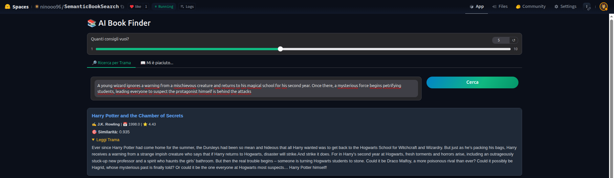

# 📚 Semantic Book Search Engine (2.4M+ Books)

[-teal)](https://turso.tech/)

> An End-to-End AI Search Engine capable of indexing and retrieving semantic matches from a dataset of over **2.4 million books**, optimized for low-resource environments.

---

## 🚀 Overview

This project implements a **Hybrid Retrieval System** that allows users to search for books not just by keywords, but by **meaning, plot description, atmosphere, or emotion**.

Unlike traditional keyword search, this engine uses **Vector Embeddings** to understand the semantic intent of the query. To ensure scalability and performance within free-tier constraints, the system employs an optimized architecture separating Vector Search (Qdrant) from Metadata Storage (Turso/LibSQL).

### Key Features
* **🔎 Semantic Search:** Find books by describing the plot (e.g., *"A dystopian novel where books are banned"*).
* **📖 Recommendation System:** "More like this" feature based on vector proximity (Item-to-Item retrieval).
* **⚡ Hybrid Architecture:** Orchestration of a Vector DB and an Edge SQL DB for optimal resource usage.

---

## 🛠️ Architecture & Engineering

The system is designed to minimize RAM usage while maximizing retrieval speed.

### The Pipeline
1.  **ETL & Preprocessing:** Cleaning and processing a raw CSV dataset of 2.4M+ rows.
2.  **Embedding Generation:** Using `intfloat/multilingual-e5-small` on Multi-GPU to convert book summaries into vector embeddings.
3.  **Hybrid Storage Strategy:**
    * **Vectors (RAM/Disk):** Stored in **Qdrant**. Contains *only* the embeddings and the Book ID.
    * **Metadata (Disk/Edge):** Stored in **Turso (LibSQL)**. Contains Book ID, Title, Author, Year, Summary, and Rating.
4.  **Inference & UI:** A **Gradio** interface (hosted on Hugging Face Spaces).

---

## 👨‍💻 Author

**Antonio Gagliostro**
* **Role:** AI & Machine Learning Engineer
* **Connect:** [LinkedIn](https://www.linkedin.com/in/antonio-gagliostro-1b4751121) | [GitHub](https://github.com/ninooo96)